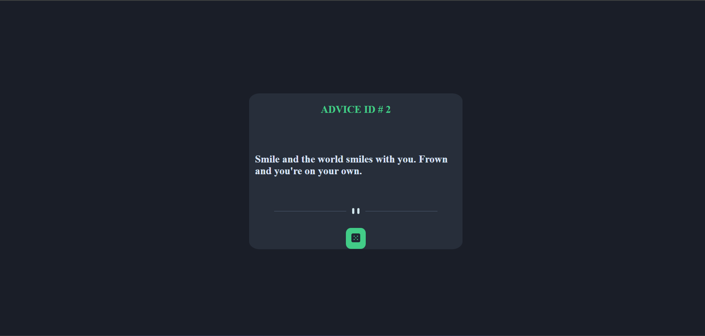

<h1 style="text-align:center;"> Random Advice </h1>

 <a href="https://mike14112.github.io/RandomAdvice/
 " style="color:skyblue; font-size:26px; text-align:center; ">Link this Project   </a> 

 <h2>About this Project 😊 </h2>
 <h3> Hello!  Don't expect anything big from this project . This project, based on an API key, gives you random tips, isn't it sweet? It's my first project where I wanted to apply my knowledge of working with databases.</h3>

<h2> Languages and Tools: </h2>
<h3>   </h3>
 <h2>Installation Guide</h2> 
 <h3> git clone  https://mike14112.github.io/RandomAdvice/ </h3>
 